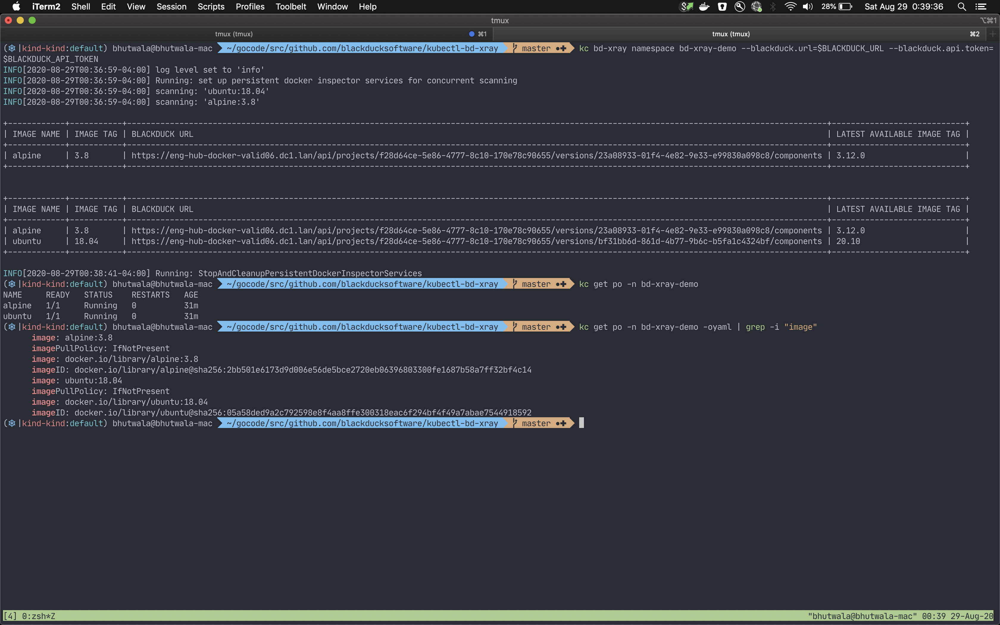
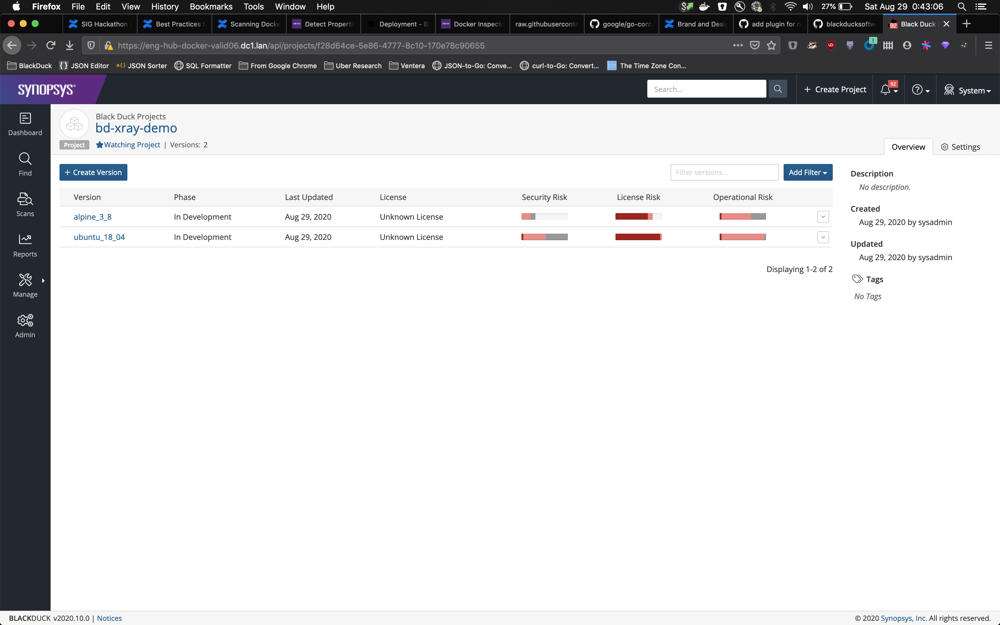

<!-- omit in toc -->
# kubectl-bd-xray: Black Duck X-Ray

This plugin runs Black Duck Image Scans for software composition analysis.  Just point and scan images in any namespace, third-party or your own yaml files, helm charts and more.  It also suggests image upgrades for outdated images.  Check out the [future section here](#future) for exciting coming soon features!

See [demo images here](./examples/demo/)




TODO: put video here

<!-- omit in toc -->
## Table of Contents

- [Installation](#installation)
  - [From source](#from-source)
    - [Build](#build)
    - [Run](#run)
    - [How to build and use as kubectl plugin](#how-to-build-and-use-as-kubectl-plugin)
  - [From Release Binary](#from-release-binary)
    - [macOs](#macos)
  - [From Krew](#from-krew)
- [Usage](#usage)
  - [`bd-xray namespace`: scan all images in a namespace](#bd-xray-namespace-scan-all-images-in-a-namespace)
  - [`bd-xray images`: scan any set of images](#bd-xray-images-scan-any-set-of-images)
  - [`bd-xray yaml`: scan images from given yaml file](#bd-xray-yaml-scan-images-from-given-yaml-file)
  - [`bd-xray helm`: scan images from given helm chart](#bd-xray-helm-scan-images-from-given-helm-chart)
- [Dev notes](#dev-notes)
  - [Release](#release)
    - [Dry-run](#dry-run)
    - [Push](#push)
    - [Deleting tags](#deleting-tags)
  - [Testing Krew release locally](#testing-krew-release-locally)
- [Future](#future)

## Installation

### From source

#### Build

```bash
go build ./cmd/bd-xray/main.go

./bd-xray --help
```

#### Run

```bash
go run ./cmd/bd-xray/main.go --help
```

#### How to build and use as kubectl plugin

```bash
go build ./cmd/bd-xray/main.go

mv ./bd-xray "/TODO-somewhere-in-your-path/kubectl-bd_xray"

kubectl plugin list

kubectl bd-xray --help
```

### From Release Binary

#### macOs

You can download and use as a standalone binary.

```bash
download_path="./bd-xray"
version="v0.1.0"

curl --fail --location --output $download_path "https://github.com/blackducksoftware/kubectl-bd-xray/releases/download/${version}/kubectl-bd-xray_${version}_darwin_amd64.tar.gz"
chmod +x $download_path

$download_path --help
```

Or you can follow the below steps after the aboves steps to use it as a kubectl plugin

```bash
mv $download_path "/TODO-somewhere-in-your-path/kubectl-bd_xray"

kubectl plugin list

kubectl bd-xray --help
```

### From Krew

TODO: Pending

```bash
curl https://krew.sh/bd-xray | bash
# . ~/.bashrc   # run if you use bash shell
# . ~/.zshrc    # run if you use zsh shell
```

## Usage

Use the `--help` flag with the root and/or any of the subcommands to find out more information

```bash
kubectl bd-xray --help
```

### `bd-xray namespace`: scan all images in a namespace

```bash
kubectl bd-xray namespace --help

NAMESPACE_NAME="TODO"
BLACKDUCK_URL="TODO"
BLACKDUCK_API_TOKEN="TODO"
kubectl bd-xray namespace $NAMESPACE_NAME --blackduck.url=$BLACKDUCK_URL --blackduck.api.token=$BLACKDUCK_API_TOKEN
```

### `bd-xray images`: scan any set of images

```bash
kubectl bd-xray images --help

BLACKDUCK_URL="TODO"
BLACKDUCK_API_TOKEN="TODO"
kubectl bd-xray images ubuntu:18.04 alpine:3.8 --blackduck.url=$BLACKDUCK_URL --blackduck.api.token=$BLACKDUCK_API_TOKEN
```

### `bd-xray yaml`: scan images from given yaml file

```bash
kubectl bd-xray yaml --help

PATH_TO_YAML_FILE="TODO"
BLACKDUCK_URL="TODO"
BLACKDUCK_API_TOKEN="TODO"
kubectl bd-xray yaml $PATH_TO_YAML_FILE  --blackduck.url=$BLACKDUCK_URL --blackduck.api.token=$BLACKDUCK_API_TOKEN
```

### `bd-xray helm`: scan images from given helm chart

```bash
kubectl bd-xray helm --help

HELM_CHART="stable/atlantis"
BLACKDUCK_URL="TODO"
BLACKDUCK_API_TOKEN="TODO"
kubectl bd-xray helm $HELM_CHART  --blackduck.url=$BLACKDUCK_URL --blackduck.api.token=$BLACKDUCK_API_TOKEN
```

## Dev notes

### Release

#### Dry-run

```bash
./release.sh -d
```

#### Push

```bash
git tag v0.1.1
git push --tag
```

#### Deleting tags

```bash
git tag -d v0.1.0
```

### Testing Krew release locally

TODO: come back to this, since currently `./deploy/krew/bd-xray.yaml` is templated for automated releases.

(For developers) To provide a custom plugin manifest, use the --manifest or
  --manifest-url arguments. Similarly, instead of downloading files from a URL,
  you can specify a local --archive file:
    kubectl krew install --manifest=FILE [--archive=FILE]

```bash
# kubectl krew install --manifest="./deploy/krew/bd-xray.yaml"
# kubectl krew install --manifest="./deploy/krew/bd-xray.yaml" --archive="./dist/kubectl-bd-xray_v0.1.0_darwin_amd64.tar.gz"
```

## Future

- show difference in vulnerabilities between existing image and the suggested upgrade remediation image
- suggest upgrade remediation of base image
- suggest upgrade remediation for helm charts
- allow setting concurrency of scans (currently "infinite")
- multiple modes of operation
  - concurrent scans locally with persistent docker container (currently already)
  - concurrent scans in the cluster in same namespace, 1 job per image
